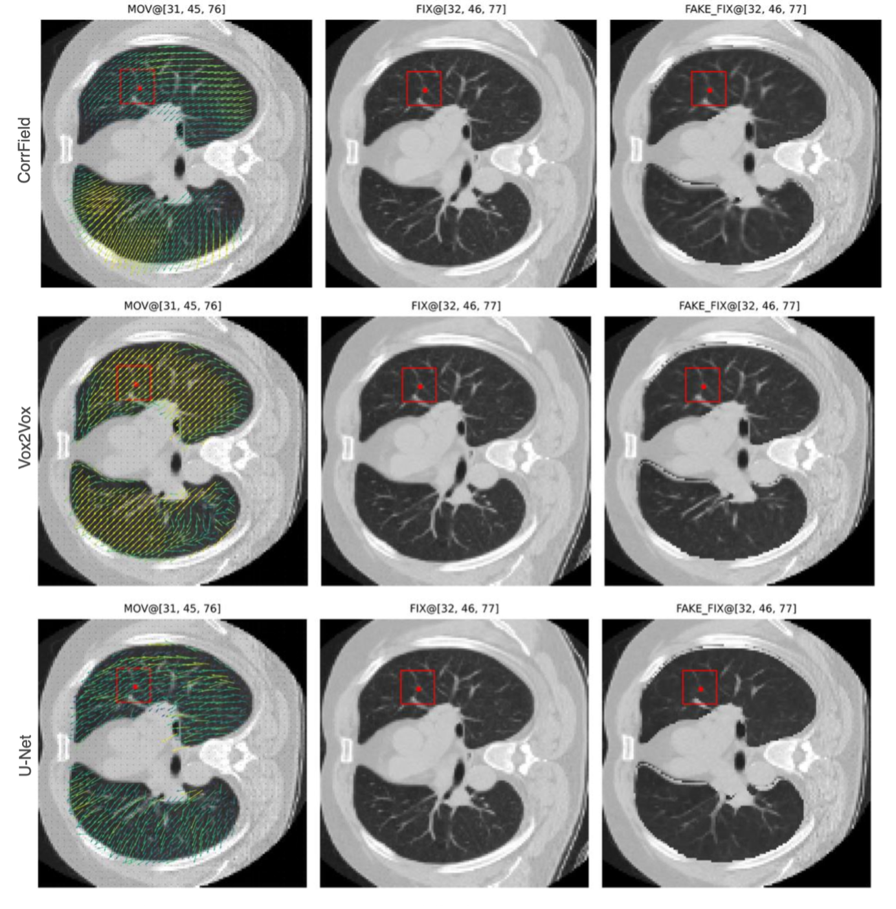
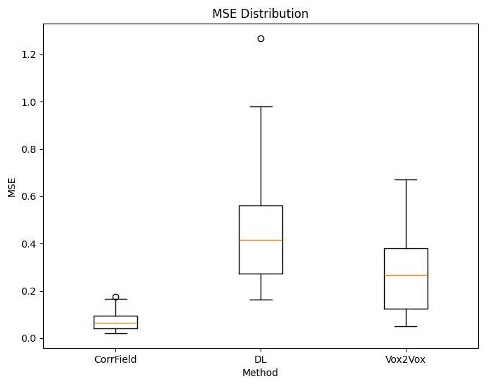
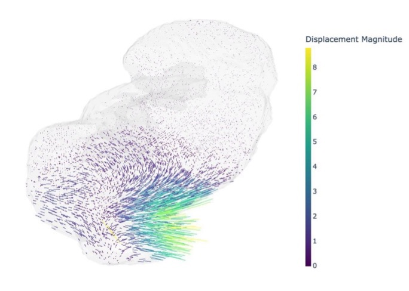
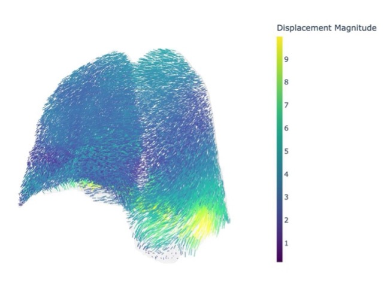
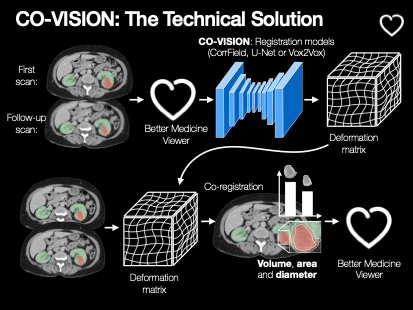

*This is a template repository for this organization. Start by replacing the placeholder for the project name with its actual title.*

# [Demonstration Project title]

## Summary
| Company Name | [Company](https://website.link) |
| :--- | :--- |
| Development Team Lead Name | Joonas Ariva |
| Development Team Lead E-mail | [joonas.ariva@ut.ee](mailto:joonas.ariva@ut.ee) |
| Duration of the Demonstration Project | 8 months |
| Final Report | [Example_report.pdf](./files/Demoprojekti_lõpparuanne_Final_Report.docx) |

### Each project has an alternative for documentation
1. Fill in the [description](#description) directly in the README below *OR*;
2. make a [custom agreement with the AIRE team](#custom-agreement-with-the-AIRE-team).

# Description
## Objectives of the Demonstration Project
*Please describe your project objectives in detail.*

The project aimed to demonstrate the feasibility and validate the performance of an AI-based co-registration model for longitudinal CT scans, initially focused on renal tumours. The objective was to build a system capable of accurately aligning multiple CT scans from the same patient acquired at different time points, enabling consistent comparison and tumour tracking. The demonstration focused on developing and benchmarking co-registration methods and building a synthetic validation pipeline.

## Activities and Results of the Demonstration Project
### Challenge
*Please describe challenge addressed (i.e, whether and how the initial challenge was changed during the project, for which investment the demonstration project was provided).*

The challenge addressed in the CO-VISION project was the difficulty and time consumption involved in comparing longitudinal CT scans, especially in the context of renal tumours. Due to limited availability of longitudinal kidney CT scan pairs at the start of the project, the development began with lung CT data, which was more accessible and enabled faster prototyping. This allowed the team to make significant progress in building and testing the core components of the system, including AI-based co-registration models and a custom synthetic data generation pipeline.

Later in the project, kidney data from the Tartu University Hospital (TUH) was incorporated. Using the synthetic pipeline, we created simulated longitudinal kidney scans for validation. This shift aligned well with the original objective and demonstrated the generalizability of our approach. 

### Data Sources
*Please describe which data was used for the technological solution.*  
- CT scans from Tartu University Hospital (under TUH ethical approvals)
- Public datasets including NLST, KiRC, and TotalSegmentor
- Synthetic paired CT scans generated using custom data generation pipeline

### AI Technologies
*Please describe and justify the use of selected AI technologies.*
- The first algorithm used was CorrField, one of the most well-known classical deformable image registration algorithms in the field. CorrField is widely regarded for its robustness and has been proven effective in various medical imaging tasks. We showed that it works reliably on CT scans and used its output — the dense deformation fields (DDFs) — as supervision for training our first AI model.
- The second algorithm used was purly Deep Learning approach, utilising a U-Net model. U-Net is one of the most established and widely adopted deep learning models in medical image analysis. It is known for its simplicity, efficiency, and high accuracy in various segmentation and prediction tasks. We adapted it to learn to predict the DDF directly from paired CT scans. Results showed that U-Net was capable of reproducing CorrField outputs, validating it as a strong baseline model for learned co-registration
- The third algorithm used was another Deep Learning approach. We developed an AI model based on Vox2Vox architecture - a 3D generative adversarial network (GAN). Unlike U-Net, Vox2Vox does not rely on precomputed DDFs or keypoints from CorrField or any other algorithm. Instead, it uses a generator-discriminator setup to produce realistic DDFs directly. In our experiments, Vox2Vox performed better than U-Net, producing more accurate and anatomically plausible deformations.

### Technological Results
*Please describe the results of testing and validating the technological solution.*

In our experiments, Vox2Vox performed better than U-Net, producing more accurate and anatomically plausible deformations.

<!--  -->

    

"><em>Comparison of Dense Displacement Fields (DDF) produced by CorrField, Vox2Vox, and U-Net. The color of DDF shows the strength of the displacement - the brighter the stronger. The red keypoints serve as anchor points to visualise the proper slices along axial plane. We have used 2 stage CorrField with default hyperparameters. Both, Vox2Vox and U-Net models were trained on the NLST training set. The images are taken from validation set.</em>

### Technical Architecture
*Please describe the technical architecture (e.g, presented graphically, where the technical solution integration with the existing system can also be seen).*

- [Component 1],
- [Component 2], 
- etc... .

### User Interface 
*Please describe the details about the user interface(i.e, how does the client 'see' the technical result, whether a separate user interface was developed, command line script was developed, was it validated as an experiment, can the results be seen in ERP or are they integrated into work process)*

No dedicated UI developed during this project. Results are currently available as part of the internal experimentation pipeline.

Better Medicine team integrate the solution into the BMVision platform UI, where radiologists can view registered scans and derived insights

### Future Potential of the Technical Solution
*Please describe the potential areas for future use of the technical solution.*
- Longitudinal tumour tracking in oncology
- Automated radiology assistant platforms (e.g. Better Medicine’s BMVision)
- Follow-up scan comparison in treatment monitoring
- Pre-operative planning in complex tumour cases

### Lessons Learned
*Please describe the lessons learned (i.e. assessment whether the technological solution actually solved the initial challenge).*

The project confirmed the viability of AI-based co-registration for CT scans. While the switch to lung data at first was pragmatic due to better access to longitudional studies, the architecture has proven flexible and applicable to kidney tumors. The synthetic pipeline that we have developed prooved itself as a valuable asset for future testing and development. Initial goals were achieved, and the technical solution is already influencing the company’s product strategy.

# Custom agreement with the AIRE team
*If you have a unique project or specific requirements that don't fit neatly into the Docker file or description template options, we welcome custom agreements with our AIRE team. This option allows flexibility in collaborating with us to ensure your project's needs are met effectively.*

*To explore this option, please contact our demonstration projects service manager via katre.eljas@taltech.ee with the subject line "Demonstration Project Custom Agreement Request - [Your Project Name]." In your email, briefly describe your project and your specific documentation or collaboration needs. Our team will promptly respond to initiate a conversation about tailoring a solution that aligns with your project goals.*
